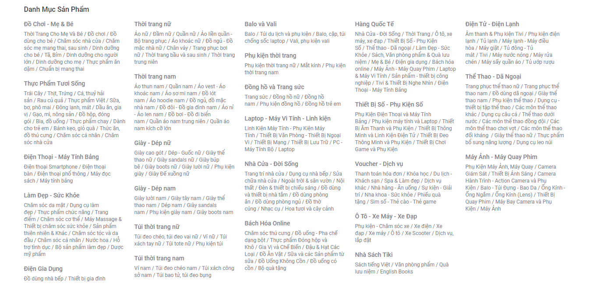

<h1 align="center">Tiki Crawler with Scrapy</h1>


## ⚙️ Install dependencies
```
pip install -r requirements.txt
cd tiki
```
If you cannot install Scrapy on MacOS, please refer to this [link](https://docs.scrapy.org/en/latest/intro/install.html) for proper guide.


## 👨‍💻 Run Scrapy crawler
### Crawl by keyword
```python
scrapy crawl <spider_name> -o <output_file_path>:<file_format> \
                            -s IMAGES_STORE=<image_saved_path> \
                            -s FEED_EXPORT_INDENT=<indent_for_json> \
                            -a keyword="<your_keyword>" \
                            -a parser_type=<>
                            -a sort_type=<product_list_sort_type> \
                            -a num_products=<number_of_product_to_crawl>
```
Ex:
```python
scrapy crawl tiki_crawler -o data/data.csv -s IMAGES_STORE=data/images -a keyword="iPhone"
```
### Crawl by category
```python
scrapy crawl <spider_name> -o <output_file_path>.<file_format> \
                            -s IMAGES_STORE=<image_saved_path> \
                            -a category="<category_name>" \
                            -a sort_type=<product_list_sort_type> \
                            -a num_products=<number_of_product_to_crawl>
```
Ex:
```python
scrapy crawl tiki_crawler -o data/data.json -s IMAGES_STORE=data/images -a category="Điện thoại Smartphone"
```
### 📝 Note
- Only support categories from [categories](examples/category_names.txt) and [subcategories](examples/subcategory_names.txt).
- Supported output file format: ```csv```, ```json```, ```jsonl```, ```pickle```, ```xml```, ```marshal```. Refer [here](https://docs.scrapy.org/en/latest/topics/feed-exports.html) for more information.



### 📔 Arguments detail
- ```-o <OUTPUT_FILE>```: We define the output path, filename and format after ```-o``` argument. This argument must always be input when running a new script.
- ```-s IMAGES_STORE```: We specify new output path of downloading images by using this argument. Default directory: ```data/images```.
- ```-s FEED_EXPORT_INDENT```: Amount of spaces you want to indent for output json file. Default indent: ```4```. For lighter output file, set this argument to ```0```.
- ```-a keyword```: Search products by keywords. Remember to put your keywords in the quotes ```""``` to avoid spacing error.
- ```-a category```: Search products by categories. Remember this argument and ```keyword``` argument cannot be used at the same time.
- ```-a sort_type```: Product display in this order. Supported options: ```popular```, ```top_seller```, ```newest```, ```asc```, ```desc```. Default: ```popular```.
- ```-a parser_type```: Choose which parser to get product information. Supported options: ```api```, ```html```. Default: ```api```. Work only for ```keyword```.
- ```-a num_products```: Number of products you want to crawl. Default: ```50```.

## Additional Information
To understand what I've done in this project. Please refer to my notes below:
- Scrapy at a glance: [scrapy](docs/scrapy.md).
- Crawling by keyword: [keyword](docs/keyword.md).
- Crawling by category: [category](docs/category.md).
- Personal experience and comparison: [comparision](docs/comparison.md).
